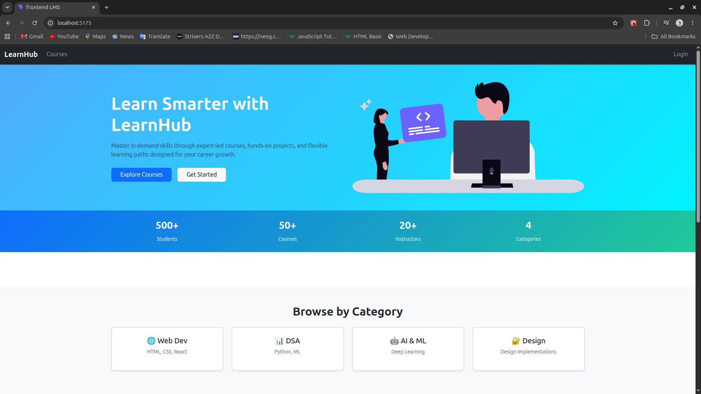
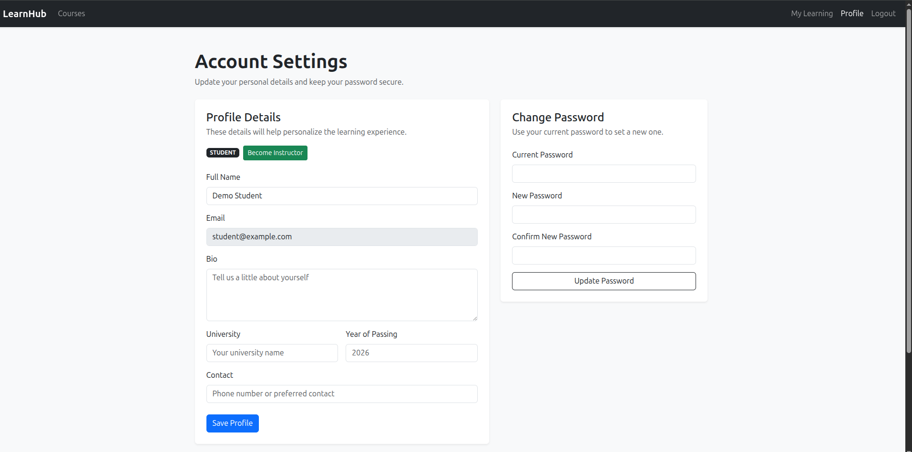
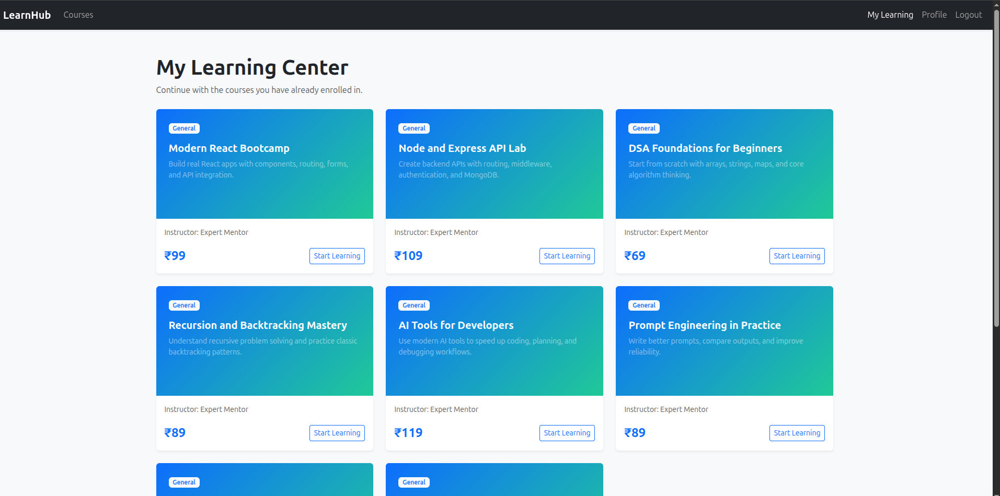
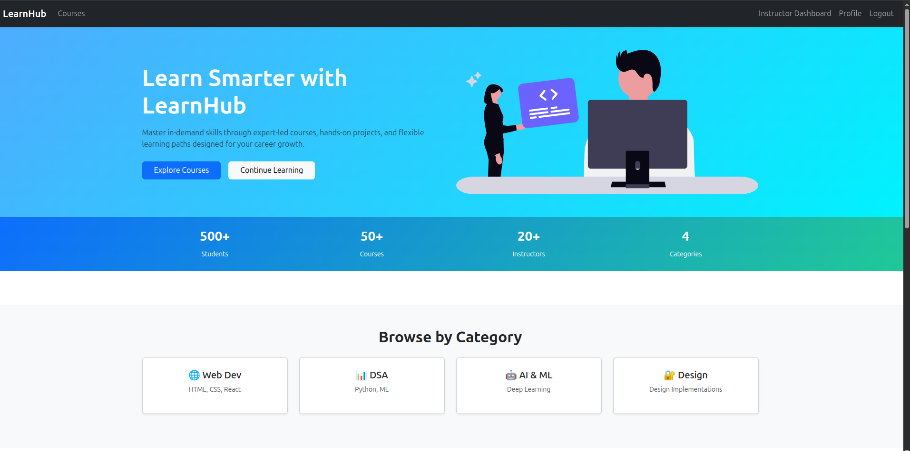
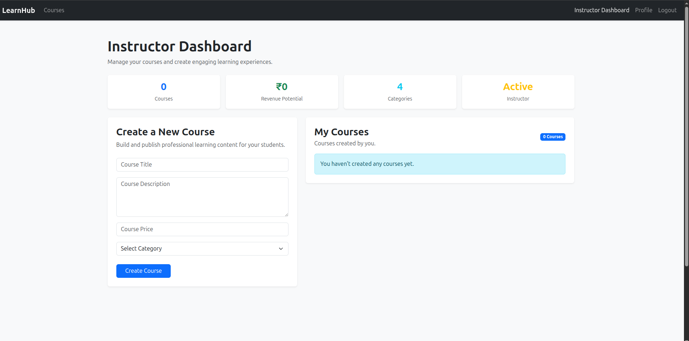

# 🎓 LearnHub

A production-style Learning Management System (LMS) built with the MERN stack that enables students to discover, purchase, and consume online courses while empowering instructors to create and manage educational content through a dedicated dashboard.

LearnHub demonstrates full-stack application development with authentication, role-based authorization, payment integration, dashboard workflows, course management, and scalable content organization commonly found in modern EdTech platforms.

---

## 🚀 Live Demo

### Frontend

https://lms-mu-hazel.vercel.app

### Backend API

https://lms-4cho.onrender.com

---

## ✨ Key Highlights

* JWT Authentication & Authorization
* Role-Based Access Control
* Student & Instructor Dashboards
* Course Creation & Management
* Stripe Payment Integration
* Course Enrollment Workflow
* Modular Course Structure
* Responsive User Interface
* MERN Stack Architecture

---

# 📸 Screenshots

## Homepage

Students can browse available courses, explore categories, and discover learning opportunities.

---

## Student Profile

Students can manage their account, update educational details, change passwords, and apply to become instructors.

---

## Learning Experience

Students can access enrolled courses, navigate modules and lessons, and continue learning through the lesson player.

---

## Instructor Home

Dedicated instructor experience providing quick access to course management features.

---

## Instructor Dashboard

Instructors can create courses, manage curriculum, organize modules, and maintain lesson content.

---

# 🔐 Authentication & Authorization

* JWT-Based Authentication
* Secure Login & Registration
* Protected Routes
* Role-Based Access Control
* Student & Instructor Permissions

---

# 👨‍🎓 Student Features

### Course Discovery

* Browse Courses
* Explore Categories
* View Course Details
* Review Curriculum Structure

### Enrollment & Learning

* Secure Course Purchase
* Automatic Enrollment
* Personalized Learning Dashboard
* Access Course Content
* Video Lesson Player

### Account Management

* Profile Management
* Password Updates
* Educational Information Management
* Instructor Application Workflow

---

# 👨‍🏫 Instructor Features

### Course Management

* Create Courses
* Edit Courses
* Delete Courses

### Curriculum Management

* Create Modules
* Delete Modules
* Create Lessons
* Delete Lessons
* Organize Course Structure

### Dashboard Management

* Manage Published Content
* Update Educational Material
* Monitor Course Organization

---

# 💳 Payments

LearnHub integrates Stripe for secure payment processing.

### Payment Workflow

1. Student selects a course
2. Secure Stripe checkout is initiated
3. Payment is processed
4. Student is automatically enrolled
5. Course becomes available in the learning dashboard

---

# 🛠️ Tech Stack

## Frontend

* React
* React Router
* Bootstrap 5
* Axios
* Vite
* Stripe React SDK

## Backend

* Node.js
* Express.js
* MongoDB Atlas
* Mongoose
* JWT
* Stripe API

## Deployment

* Vercel (Frontend)
* Render (Backend)
* MongoDB Atlas (Database)

---

# 🗄️ Database Design

The platform follows a hierarchical educational structure:

Course
└── Modules
└── Lessons

This design enables scalable curriculum organization and simplifies content management for instructors.

---

# 📂 Project Structure

frontend/
server/
assets/

---

# 🎯 Technical Concepts Demonstrated

* Full Stack MERN Development
* REST API Design
* Authentication & Authorization
* Protected Routes
* Role-Based Access Control
* Payment Gateway Integration
* MongoDB Data Modeling
* Dashboard Architecture
* CRUD Operations
* Responsive UI Development
* Deployment & Hosting

---

# 🔮 Future Improvements

* Course Reviews & Ratings
* Learning Progress Tracking
* Certificates of Completion
* Quiz & Assessment System
* Instructor Analytics
* AI-Powered Learning Assistant
* Discussion Forums
* Course Recommendations

---

# 👨‍💻 Author

### Paritosh Singh

Full Stack Developer | MERN Stack | ECE Undergraduate

### Connect With Me

LinkedIn:
[www.linkedin.com/in/paritosh-singh-dev](http://www.linkedin.com/in/paritosh-singh-dev)

GitHub:
https://github.com/paritoshXsingh
